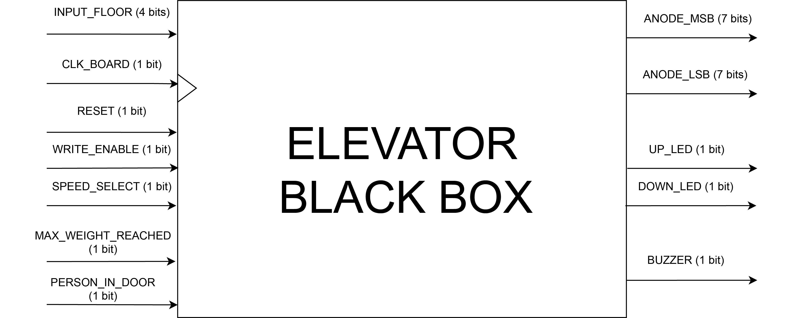
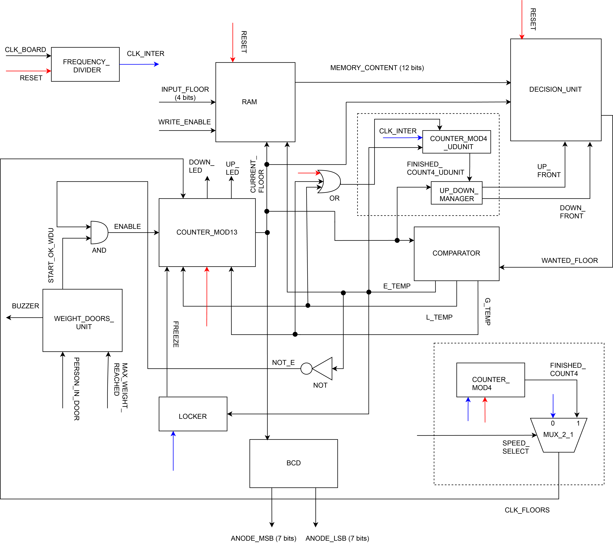

# Elevator Control Unit

> This repository contains an elevator control unit written in VHDL. The target hardware is an **FPGA**-based board. 

## Authors
* Radu-Augustin Vele
* Vlad Onea

## About the Project
The project follows a **structural implementation** approach meaning that the elevator wrapper (in main.vhd) contains instances of basic components (comparators, logic gates, counters, etc.) without long fragments of sequential code.

The blackbox and the detailed schematic are presented below (for a higher resolution and uncropped images check the svg files in the diagram directory).

While developing, the goal was to gain a deeper understanding of digital systems and hardware description language. 

The project has been simulated using the Active HDL software program. Xilinx's Vivado is a more suitable choice for synthesizing and implementing it on the FPGA. 

## Further improvements:
- adapt the project for the board ([Digilent's Basys 3](https://digilent.com/shop/basys-3-artix-7-fpga-trainer-board-recommended-for-introductory-users/)) using a constraints file.
- test and debug on the board.
- add peripherals like a buzzer, or various actuators.
- use a **finite state machine** kind of design to have a cleaner and easier to understand logic (transformation of the whole structure of the project).
